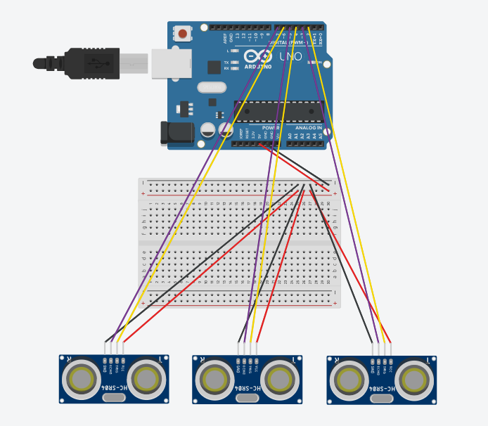

 # Project_Roomball
A project for the "Robot Motion Planning Workshop" at TAU.📚

The project makes use of the mycobot robotic arm & the iRobot Create🤖.

## Roomball User Manual

### Requirements
- [iCreate 3](https://edu.irobot.com/what-we-offer/create3) (iRobot Create) - a mobile robot platform.✅
- [myCobot 280](https://www.elephantrobotics.com/en/mycobot-280-pi-2023-en/) robotic arm (by Elephant Robotics).💪
- [Python](https://www.python.org/) 3.9 or later.🐍
- Installing the [irobot_edu_sdk](https://pypi.org/project/irobot_edu_sdk/) package:💻
    ```bash
    pip install irobot_edu_sdk
    ```
- Bluetooth connection - to communicate with the iRobot Create.📡

### Usage
#### Preparations
1. Ensure the bluetooth is enabled, and the iRobot create is charged and turned on.
2. Connect the Arduino to the myCobot.
3. Connect the 3 sensors to the Arduino:
    - Trigger pins: 2, 4, 6.
    - Echo pins: 3, 5, 7.
    - We recommend using a breadboard to connect the sensors to the Arduino.

    The following is a diagram of the Arduino setup:

    

##### Running the program
1. Run the following command in the terminal:
    ```bash
    python3 irobot_locate.py <MYCOBOT_SERVER_IP> <MYCOBOT_PORT_NUMBER>
    ```
    Replace `<MYCOBOT_SERVER_IP>` and `<MYCOBOT_PORT_NUMBER>` with the IP address and port number of your myCobot device.
    > ❗ **Note:** The computer running the program must be connected to the same network as the myCobot device.

2. The program will start running and the iRobot Create will start looking for the objects.

## myCobot Server User Manual
### Requirements
- [myCobot 280](https://www.elephantrobotics.com/en/mycobot-280-pi-2023-en/) robotic arm (by Elephant Robotics).💪
- [Python](https://www.python.org/) 3.9 or later, installed on the myCobot's Raspberry Pi.🐍
- Installing the [pymycobot](https://pypi.org/project/pymycobot/) package on the Raspberry Pi:💻
    ```bash
    pip install pymycobot
    ```

### Usage
#### Preparations
1. Connect to the myCobot's Raspberry Pi via SSH.
2. Transfer the `mycobot_server.py` file to the Raspberry Pi (e.g. via SCP).
3. In order to make the sensors accessible through the server, follow the Arduino instructions in the [Roomball User  Manual](#preparations).

#### Running the program
1. Run the following command in the Raspberry Pi terminal:
    ```bash
    python3 mycobot_server.py <MYCOBOT_SERVER_IP> <MYCOBOT_PORT_NUMBER>
    ```
    Replace `<MYCOBOT_SERVER_IP>` and `<MYCOBOT_PORT_NUMBER>` with the desired IP address and port number of the server.
2. The server will start running and log the incoming requests.

#### Automatic myCobot Server Activation at Startup
You might find it useful to automatically start the myCobot server when the Raspberry Pi boots up.\
This enables you to control the myCobot remotely without the need to manually start the server via SSH each time.\
To do so, follow these steps:
1. Create a new service file:
    ```bash
    sudo nano /etc/systemd/system/mycobot_server.service
    ```
2. Add the following content to the file:
    ```
    [Unit]
    Description=myCobot Server
    After=network.target

    [Service]
    Type=simple
    ExecStart=/usr/bin/python3 <MY_COBOT_SERVER_PATH>/mycobot_server.py <MYCOBOT_SERVER_IP> <MYCOBOT_PORT_NUMBER>
    WorkingDirectory=<MY_COBOT_SERVER_PATH>
    StandardOutput=append:<MY_COBOT_SERVER_PATH>/logs/log.txt
    StandardError=append:<MY_COBOT_SERVER_PATH>/logs/error_log.txt
    Restart=on-failure
    User=<USER_NAME>
    Environment="PYTHONUNBUFFERED=1"

    [Install]
    WantedBy=multi-user.target
    ```
    Replace `<MY_COBOT_SERVER_PATH>`, `<MYCOBOT_SERVER_IP>`, and `<MYCOBOT_PORT_NUMBER>` with the desired path to the server file, IP address, and port number, respectively.\
    Replace `<USER_NAME>` with the username of the Raspberry Pi user - it will be `er` by default.
3. Save the file and exit the text editor.
4. Reload the systemd manager configuration:
    ```bash
    sudo systemctl daemon-reload
    ```
5. Enable the service to start on boot:
    ```bash
    sudo systemctl start mycobot_server.service
    sudo systemctl enable mycobot_server.service
    sudo systemctl status mycobot_server.service
    ```